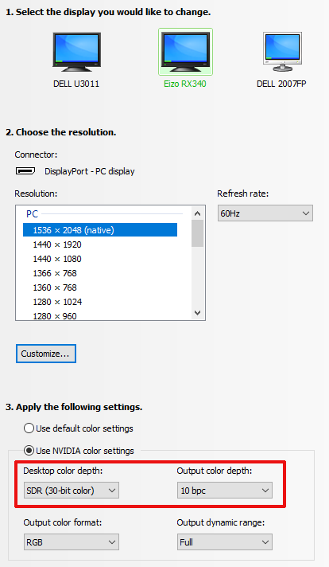
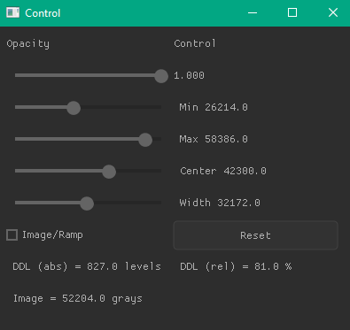
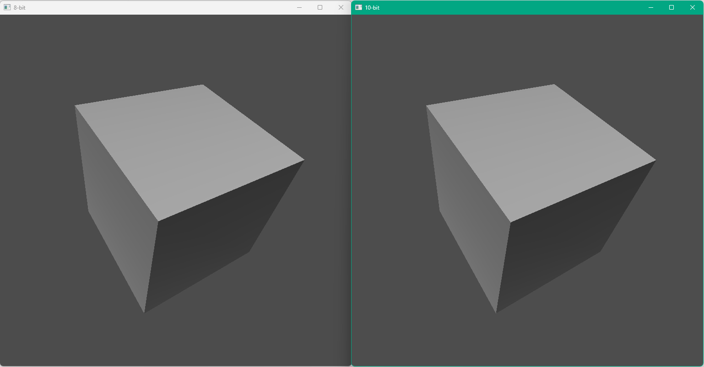

# 10-bit-OpenGL-GLFW
How to use 10-bit Display Mode using OpenGL/GLFW.

Using 10-bit you will see much less [banding](https://en.wikipedia.org/wiki/Colour_banding), especially on the medical monitor, because this will allow to have 1024 shades of gray instead of 256.

Was tested on the following configuration:

**Graphic Adapter** — NVIDIA Quadro RTX 4000

**Monitor** — EIZO RadiForce RX340 Medical Monitor (DELL U3011 also was tested)

The Monitor shall be connected to Display Port.

The following settings needs to be changed:



The trick is to set 10 bit before OpenGL Window's creation:

```c
    wImage8 = glfwCreateWindow(ImageWidth, ImageHeight, "8-bit", NULL, NULL);

    glfwWindowHint(GLFW_RED_BITS, 10); //must be called before windows's creation
    glfwWindowHint(GLFW_GREEN_BITS, 10);
    glfwWindowHint(GLFW_BLUE_BITS, 10);
    glfwWindowHint(GLFW_ALPHA_BITS, 2);
    wImage10 = glfwCreateWindow(ImageWidth, ImageHeight, "10-bit", NULL, NULL);
```

And use GL_RGB10 for textures

```c
glTexImage2D(GL_TEXTURE_2D, 0, GL_RGB10, ImageWidth, ImageHeight, 0, GL_RGB, GL_UNSIGNED_SHORT, pixelsU16);
```

There are four small projects, each one will open two windows — one in 8 bit mode, and another one in 10 bit, so you can compare both visually to check that the banding effect is disappeared on 10 bit.

#### Demo-10 bit

This one will show gradient ramp


or real x-ray image:


The settings will allow to change Min/Max (Center/Width) Levels and measure DDLs.



#### Simple-10 bit

Just triangle from GLFW "Hello World", slightly modified:


#### Cube-10 bit

Rotating Cube with gradients:



#### CubeLight-10 bit

Rotating cube with lighting


Microsoft Visual Studio 2022 v.17.8.6 was used. x64 only.
