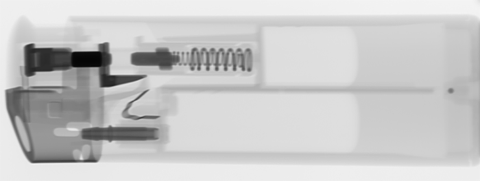
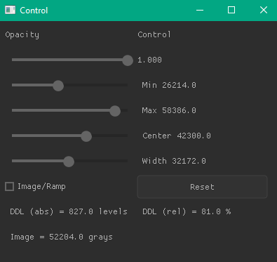
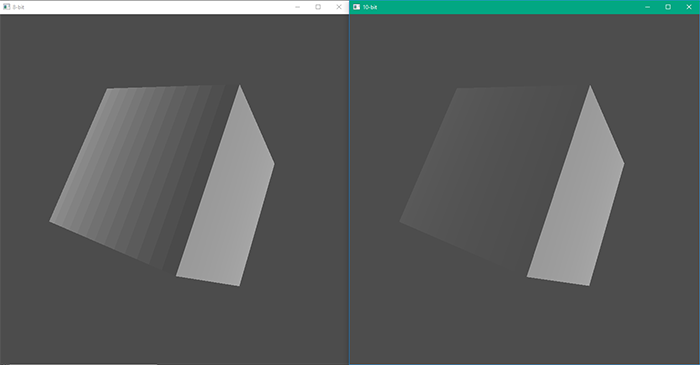

### Об отображении 10-бит цвета с использованием OpenGL (**GLFW**)

Вашему внимания предлагается небольшой этюд, посвящённый отображению 10-битного цвета на мониторе через OpenGL при помощи библиотеки GLFW. Под катом мы напишем пару небольших приложений, открывающих два окна, где рассмотрим тестовые изображения (в том числе коснёмся рентгеновских изображений) в восьмибитном и десятибитном отображении на оборудовании, поддерживающем такие режимы. Включение 10 бит в основном позволяет избавиться от эффекта "бандинга", возникающего на протяжённых градиентах со слабо меняющейся интенсивностью, когда вы начинаете видеть границы между отдельными градациями.

---

Начну я, пожалуй, сразу со спойлера, чтобы сэкономить время тех, у кого нет времени или желания читать пост целиком. Вкратце — мы просто добавим перед созданием окна вот такой вот код:

```c
    glfwWindowHint(GLFW_RED_BITS, 10);
    glfwWindowHint(GLFW_GREEN_BITS, 10);
    glfwWindowHint(GLFW_BLUE_BITS, 10);
    glfwWindowHint(GLFW_ALPHA_BITS, 2);
```

И этого в общем-то будет достаточно для того, чтобы окно начало отображаться в десятибитном режиме (полный код будет выложен на гитхаб, ссылка в конце статьи).

Ну а те, кто хочет глубже погрузиться в большее число бит — могут прочесть целиком, возможно кому-то информация окажется интересной или полезной. Дисклеймер — я не имею прямого отношения ни к одной компании, упоминающейся ниже, рекламной нагрузки статья не несёт.

Прежде всего надо вкратце объяснить, зачем мне это нужно. По работе  я связан с обработкой рентгеновских изображений. В подавляющем большинстве своём изображения эти — шестнадцатибитные. Точнее, в зависимости от используемого детектора они могут быть и меньшей разрядности, скажем 12 или 14 бит, но формально для меня они именно шестнадцатибитные, просто не все старшие биты задействованы. В памяти они обычно и хранятся как  unsigned short, в редких случаях данные прилетают упакованные (тогда, например три двенадцатибитных пикселя хранятся в четырёх байтах), но всё равно для процессинга распаковываются. Факт в том, что в этих изображениях обычно несколько тысяч градаций, в пределе — 65536.

Типичное рентгеновское изображение выглядит вот так (не обращайте внимания на жидкие углеводороды, собравшиеся в правой части, изначально зажигалка была размещена вертикально, я просто повернул её на 90 градусов, чтобы пост был компактнее):



Гистограмма этого изображения вот такая:


Видно, что минимальное значение интенсивности — 1335, а максимальное — 63106, это почти полный диапазон (обычно мы не доводим уровни до насыщения — тут всё как в цифровой фотографии). Когда мы показываем такое изображение оператору, то очевидным образом не можем отобразить все градации одновременно, так как в нашем распоряжении по умолчанию всего-навсего 256 оттенков серого (R G B для серого одинаковы и могут принимать допустимые значения от 0 до 255, что очевидно). Соответственно выполняется несложное преобразование по "ремаппингу" 16 бит в 8. Это делается при помощи линейной (в редких случаях с гаммой) LUT таблицы:


Легко заметить, что мы теряем значительное количество информации (так как каждые 256 градаций исходного изображения фактически преобразуются в одно выходное значение).

Чтобы "увидеть" потерянную информацию, оператор может изменить параметры LUT, выставив значения минимума и максимума интересующего его диапазона уровней серого, например, между 45000 и 60000 уровнями:


Тогда изображение будет выглядеть примерно вот так:


Как видите, газ в зажигалке показан значительно более контрастно, можно рассмотреть шов между донышком и корпусом, но все детали устройства поджига "провалились" в чёрное. Чтобы рассмотреть их подробнее, мы переместимся на тёмную сторону:


Тогда наша картинка будет выглядеть вот так:


Теперь можно рассмотреть штуцер и даже видны небольшие дефекты

Вот так оператор и работает — постоянно крутит ползунки туда-сюда и рассматривает различные области (есть алгоритмы, автоматом выравнивающие яркость, начиная от CLAHE и заканчивая MulstiScale, используя разложение на лапласиан пирамиды или вейвлеты, но сегодня речь не об этом). Важно то, что на экране всегда присутствует лишь 256  (или меньше) градаций серого. Обычно для просмотра используется специальный "медицинский" монитор, который вообще говоря умеет показывать одновременно 1024 градации (есть даже и 12 битные мониторы) и нам хочется, чтобы LUT выглядела вот так, выдавая на выход 1024 градаций:


То есть мы будем пересчитывать значения в 1024 вместо 256. Ну и маленькое замечание — в радиографии часто используются параметры "центра и окна" вместо абсолютных значений минимума и максимума. То есть диапазон 25000...45000 задаётся как окно шириной 20000 уровней и центром в 35000. Насколько я знаю, в медицине есть даже определённые "пресеты" для костей и мягких тканей, но это немного не моя область, я всё-таки из промышленности. Но тем не менее и мы используем "медицинские" мониторы,  и интересно будет посмотреть, даст ли нам что-нибудь такое улучшение.

Дело в том, что при наличии протяжённых градиентов с небольшим перепадом яркостей мы можем получить эффект бандинга (полосатости). На КДПВ я искусственно увеличил контраст с одной стороны и добавил шум с другой, но если вы хотите реально оценить этот эффект, то вот три честные рампы в разных интенсивностях, между шагами я поставил белые метки:


#### Аппаратное обеспечение

Упражняться мы будем на вот такой конфигурации (очевидно, что поддержкой 10 бит у нас должны обладать все три компонента — монитор, графический адаптер и программное обеспечение):

Графический адаптер — NVIDIA Quadro RTX 4000

Монитор — EIZO RadiForce RX340, подключённый через Display Port.

Монитор довольно любопытный - он снабжён встроенным калибратором, который при выключении изрыгает из себя этакую пимпочку примерно раз в неделю и самокалибруется. Сертифицирован по стандарту DICOM (там требуется обеспечивать определённую яркость для определённых уровней):


Ну а программу мы напишем сами.

#### Настройка адаптера

Для того, чтобы получить 10 бит на выходе нам потребуется залезть в настройки, в случае адаптера NVIDIA вот сюда:


Если же у вас карта от AMD, то эта настройка находится вот здесь:


Далеко не все адаптеры поддерживают 10 бит (в основном это NVIDIA Quadro и AMD Radeon Pro / FirePro), кроме того монитор должен быть подключён через Display Port. Возможно, если взять DVI Dual Link, то это тоже сработает, но такую конфигурацию я не тестировал. Если у вас HDMI, то вам понадобится NVIDIA Ampere. Важно понимать, что на экране при этом ничего не поменяется, так как программное обеспечение тоже должно поддерживать этот режим, иначе картинка остаётся восьмибитной, просто старшие два не используются.

#### Программная часть

До этого момента всё было просто, но вот с программной частью пришлось немного повозиться. На сайте NVIDIA  есть небольшая [инструкция](https://www.nvidia.com/content/quadro_fx_product_literature/tb-04631-001_v05.pdf), которая рассказывает, что задействовать эти возможности можно через OpenGL (и это чуть ли не единственный способ), и там даже приводятся фрагменты кода:

Так

```c
int attribsDesired[] = {
	WGL_DRAW_TO_WINDOW_ARB, 1,
	WGL_ACCELERATION_ARB, WGL_FULL_ACCELERATION_ARB,
	WGL_RED_BITS_ARB, 10,
	WGL_GREEN_BITS_ARB, 10,
	WGL_BLUE_BITS_ARB, 10,
	WGL_ALPHA_BITS_ARB, 2,
	WGL_DOUBLE_BUFFER_ARB, 1,
	0,0
}
UINT nMatchingFormats;
int index = 0;
if (!wglChoosePixelFormat(dummyDC, attribsDesired, NULL, 1, &index, &nMatchingFormats)) {
	printf("ERROR: wglChoosePixelFormat failed!\n");
	goto cleanup;
}
```

или так

```
glutInitDisplayString("red=10 green=10 blue=10 alpha=2");
glutInitDisplayMode( GLUT_RGB | GLUT_DOUBLE | GLUT_DEPTH );
glutCreateWindow("30-bit Demo");
```

Я называю такие инструкции "ошмёточками", это когда программист выдёргивает из кода ключевые моменты, но не приводит полного проекта, так что для разработчика, который не в теме (а я никогда в жизни не работал с OpenGL) отсутствующая информация о том, какие заголовочные файлы нужно подключить, с каким библиотеками линковаться, и т.д. порой представляет собой тот ещё квест.

В поисках пути наименьшего сопротивления и места, куда бы мне вкорячить этот код, я для начала взял [freeglut](https://freeglut.sourceforge.net). 

Примитивная программа, выводящая серый градиент, набросалась довольно быстро:

```c
#include "include\glut.h"
#include "include\freeglut_ext.h"

#define ImageWidth 1024
#define ImageHeight 1024

static GLushort Image[ImageHeight][ImageWidth][3];

void display(void)
{
   glClear(GL_COLOR_BUFFER_BIT);
   glRasterPos2i(-1, -1);
   glDrawPixels(ImageWidth, ImageHeight, GL_RGB, GL_UNSIGNED_SHORT, Image);
   glFlush();
}

int main (int argc, char *argv[])
{
	for (int i = 0; i < ImageHeight; i++) {
		for (int j = 0; j < ImageWidth; j++) {
			int c = j*(65536/ImageWidth);
			Image[i][j][0] = Image[i][j][1] = Image[i][j][2] = (GLushort) c;
		}
	}
	glutInit(&argc, argv);
	glutSetOption(GLUT_ALLOW_NEGATIVE_WINDOW_POSITION, 1); //2nd monitor   
	glutInitDisplayMode(GLUT_SINGLE | GLUT_RGB);
	glutInitWindowSize(1024, 1024);
	glutCreateWindow("Gradient");
	glClearColor (0.0, 0.0, 0.0, 0.0);
	glutDisplayFunc(display);
	glutMainLoop();
	
	return 0; 
}
```

однако сколько я ни старался в дальнейшем, вставляя туда код из инструкции, добиться визуального улучшения не удалось. Наконец я заглянул в исходники и увидел там, что установка параметров при разборе строки "red=10 green=10 blue=10 alpha=2" вообще не происходит:

```c
        case 3 :  /* "blue":  Blue color buffer precision in bits */
            break ;
        case 8 :  /* "green":  Green color buffer precision in bits */
            break ;            
        case 11 :  /* "red":  Red color buffer precision in bits */
            break ;
```

 Собственно об этом сказано вот здесь — [freeglut 3.0 an onwards](https://freeglut.sourceforge.net/progress.php), но кто ж читает доки? Теперь передо мной встала дилемма — можно попытаться допилить freeglut (есть древняя полуготовая ветка [feature_30bit_framebuffer](https://github.com/freeglut/freeglut/tree/feature_30bit_framebuffer), но моих поверхностных знаний в общем недостаточно, чтобы уверенно и легко выполнить это упражнение), либо поискать что-то другое. Альтернатива openglut нашлась быстро — это [GLFW](https://www.glfw.org) и я переполз на эту библиотеку. Обнадёживал тот факт, что некоторым таки удалось получить 10 бит. Но тут меня ждала небольшая "засада" в виде того, что функция glDrawPixels(), которой я воспользовался для вывода пикселей на экран, была напрочь выпилена из версии GL 3.2. Много программистов написало во многих форумах, мол, "как так-то?", но в основном дискуссии сводились к ответам "а зачем вам это надо, ведь есть текстуры?". Ну вот когда всё, что есть в моих руках — просто указатель на область памяти с 16 бит пикселями, то хотелось бы иметь максимально простую и "прямолинейную" функцию для отображения оных на экране, а то, как это выглядит при выводе через текстуры — вы увидите ниже.

Ну, как бы то ни было, с GLFW паззл сложился. Надо сказать, что библиотека произвела неплохое впечатление, там есть набор примеров и тестов, из которых можно накопипастить на рабочий проект, хотя freeglut  мне показалось чуть проще, но общее мнение таково, что лучше пользоваться именно GLFW.

Прежде всего я посмотрел как можно вывести массив пикселов на экран и нашёл пример "[sharing](https://github.com/glfw/glfw/blob/master/examples/sharing.c)", который делал практически то, что надо, выводя массив 16х16, кроме того есть тест "[opacity](https://github.com/glfw/glfw/blob/3.3-stable/tests/opacity.c)", в котором я повстречал старого хорошего знакомого — [Nuclear](https://immediate-mode-ui.github.io/Nuklear/), это маленькая библиотека для создания GUI в одном заголовочном файле, которой я уже пользовался, добавляя интерактивности консольным приложениям. Ну и [пример из туториала](https://www.glfw.org/docs/latest/quick.html) вполне можно использовать как стартовую точку.

Я не буду детально расписывать примитивный "Hello World", всё таки мы на Хабре, но отмечу пару ключевых моментов:

Во-первых, при создании окошек после инициализации перед созданием десятибитного окошка надо установить соответствующие опции при помощи glfwWindowHint(), как я уже писал выше:

```c
//...
    if (!glfwInit()) exit(EXIT_FAILURE);
//...
	GLFWwindow *wImage8, *wImage10, *wControl;
//...
    wControl = glfwCreateWindow(400, 600, "Control", NULL, NULL); //интерфейс
    wImage8 = glfwCreateWindow(ImageWidth, ImageHeight, "8-bit", NULL, NULL);
    glfwWindowHint(GLFW_RED_BITS, 10);  // | надо вызвать перед созданием окна
    glfwWindowHint(GLFW_GREEN_BITS, 10);// | 
    glfwWindowHint(GLFW_BLUE_BITS, 10); // | 
    glfwWindowHint(GLFW_ALPHA_BITS, 2); // | 
    wImage10 = glfwCreateWindow(ImageWidth, ImageHeight, "10-bit", NULL, NULL);
```

А во-вторых при перебросе массива пикселей в текстуру надо установить цветовую модель GL_RGB10:

```с
glTexImage2D(GL_TEXTURE_2D, 0, GL_RGB10 /*!*/, ImageWidth, ImageHeight, 0, GL_RGB, GL_UNSIGNED_SHORT, pixelsU16);
```

Цикл для создания текстур мы будем крутить два раза, для каждого окна. Есть немного более элегантный способ "расшаривания" текстуры между двумя окнами, как в исходном примере, но у меня почему-то не заработал, падая ниже при попытке отрисовки (возможно это связано с разной битностью двух окон, но это не точно). Но собственно оптимизация и не является основной целью на данном этапе. Также я не буду разбирать каждую строчку, где идёт работа с текстурами и шейдерами, потому что пост в общем не об этом.

Теперь мы встаём в цикл, который крутится до тех пор, пока на экране открыты окна:

```c
while (!glfwWindowShouldClose(wImage8) && !glfwWindowShouldClose(wImage10) && !glfwWindowShouldClose(wControl)) {
```

Да, по поводу Nuklear — в цикле этом сначала работаем над окном GUI, тут мы верстаем интерфейс в две колонки, вот так это выглядит:

```c
glfwMakeContextCurrent(wControl);
glfwGetWindowSize(wControl, &widthControl, &heightControl);
float opacity = glfwGetWindowOpacity(wImage10);
struct nk_rect area = nk_rect(0.f, 0.f, (float)widthControl, (float)heightControl);
nk_glfw3_new_frame();
bool need_reset = false;
if (nk_begin(nk, "", area, 0)) {
 
    nk_layout_row_dynamic(nk, 32, 2);
    nk_label(nk, "Opacity", NK_TEXT_LEFT);
    nk_label(nk, "Control", NK_TEXT_LEFT);
    nk_slider_float(nk, 0.f, &opacity, 1.f, 0.001f);
    nk_labelf(nk, NK_TEXT_LEFT, "%0.3f", opacity);

    if (nk_slider_float(nk, 0, &Min, 65535, 1)) {
        Center = (Max - Min) / 2 + Min; Width = Max - Min;
    }
    nk_labelf(nk, NK_TEXT_LEFT, " Min %0.1f", Min);
    if (nk_slider_float(nk, 0, &Max, 65535, 1)) {
        Center = (Max - Min) / 2 + Min; Width = Max - Min;
    }
    //...
}


nk_end(nk);
nk_glfw3_render(NK_ANTI_ALIASING_ON);
glfwSwapBuffers(wControl);
```

Ну а потом дважды проворачиваем цикл рендеринга для 8 и 10 бит окон:

```c
for (int w = 0; w < 2; w++) {
	GLFWwindow* wImage;
	mat4x4 mvp;
	int width, height;

	wImage = w ? wImage8 : wImage10;
	glfwMakeContextCurrent(wImage);
	glfwSetWindowOpacity(wImage, opacity);
	glfwGetFramebufferSize(wImage, &width, &height);
	glViewport(0, 0, width, height);
	glTexImage2D(GL_TEXTURE_2D, 0, GL_RGB10, ImageWidth, ImageHeight, 0, GL_RGB, GL_UNSIGNED_SHORT, pixelsU16);
	mat4x4_ortho(mvp, 0.f, 1.f, 0.f, 1.f, 0.f, 1.f);
	glUniformMatrix4fv(mvp_location, 1, GL_FALSE, (const GLfloat*)mvp);
	glUniform3fv(color_location, 1, color);
	glDrawArrays(GL_TRIANGLE_FAN, 0, 4);
	glfwSwapBuffers(wImage);
}
glfwWaitEvents();
```

С точки зрения производительности это мягко говоря не совсем оптимально, но позволяет по крайней мере добиться требуемого результата. В некоторых случаях лучше использовать [`glTexSubImage2D`](http://www.opengl.org/wiki/GLAPI/glTexSubImage2D). Можно было бы попытаться писать сразу в фреймбуфер при помощи [`glBlitFramebuffer`](http://www.opengl.org/wiki/GLAPI/glBlitFramebuffer), но у меня навскидку не получилось (и вроде бы это поддерживается не во всех цветовых моделях).

Линковаться мы будем с glfw3.lib:

```
#pragma comment(lib, "..\\lib\\glfw3.lib")
```

Ну а картинку я "зашил" прямо в исполняемый файл, чтобы не возиться с внешними библиотеками.

Получилось вот такое нехитрое приложение — вверху 10 бит окно, а под ним — 8 бит:


Окошко контроля в исполнении Nuklear выглядит вот так:



Тут я добавил ползунки Min/Max, а также синхронизированные с ними Center/Width, кроме того показываю DDL — это расшифровывается как Digital Driving Levels, то есть интенсивность, реально отображаемая на дисплее под указателем мышки.

Почему важно знать DDL — потому что правильно калиброванный медицинский монитор должен обеспечить вполне определенные значения яркости для каждого уровня (GSDL график ниже взят из [стандарта DICOM](https://dicom.nema.org/medical/dicom/current/output/pdf/part14.pdf)):


Наконец, скомпилировавшись и подёргав ползунки, я убедился, что эффект полос бандинга, хорошо видимый в восьмибитном окне действительно отсутствует при отображении в 10 бит. Но только в синтетическом градиенте. На реальном изображении (по крайней мере на этом) мне его спровоцировать не удалось, и в реальной жизни он встречается довольно редко (как только мне попадётся реальная рентгеновская картинка, где данный эффект действительно заметен, я обновлю этот пост). А так значительной визуальной разницы при отображении реальной рентгеновской картинки практически не наблюдается.

Из известных программ, поддерживающих 10 бит, примером является Adobe Photoshop. Там в расширенных настройках можно включить 30 бит цвет:


VLC Player также по описанию поддерживает 10 бит (но у меня нет видео чтобы проверить, а попытка сгенерировать его при помощи ffmpeg провалилась - я всё равно вижу полосатость). Если кто захочет попробовать — то из стека 16-ти битных изображений я собирал видео вот так:

```
ffmpeg -y -i frame%04d.tif -c:v libx265 -pix_fmt gray10le video.mkv
```

Любопытно и то, что стоящий рядом старенький офисный Dell U3011 также вполне себе показывает 10 бит (и где-то я читал, что вся линейка UltraSharp десятибитная), так что только медицинскими мониторами дело не ограничивается.

А вот где 10 бит (тем более, что у нас в распоряжении 10 бит на каждый канал R G B) может пригодиться — это в программировании игр или трёхмерки, где плавные градиенты встречаются сплошь и рядом. Я не мог отказать себе в удовольствии покрутить треугольничек из стандартного GLFW примера, слегка поправив его и сделав двухоконным, добавив возможность на лету менять интенсивности вершин, чтобы получить вращающийся градиент:


Ну а коль скоро мы коснулись GLFW, то можно покрутить и кубик либо с градиентами по граням, либо с освещением:



На этих скриншотах выше я также искусственно поднял контраст восьмибитного окна, а по десятибитному пустил шум, чтобы хотя бы примерно показать, как это выглядит на EIZO мониторе. В реальности шаги бандинга не так контрастны.

Код этих примеров, использованный в статье лежит вот здесь: ПШЕРГИ (я не буду оформлять статью как туториал, поскольку это  вообще мой первый OpenGL проект, так что там безусловно много чего можно улучшить).

В релиз я собрал проект — можете сразу запустить (вирусов там нет). Ну или просто пересоберите его, я использовал Microsoft Visual Studio Professional 2022 (v.17.8.6). Библиотеки я оставил только 64-bit.

Ну и напоследок, если вы не хотите запускать код из гитхаба — существует утилита от NEC, которая делает ровно тоже самое, её можно найти [здесь](https://www.sharpnecdisplays.us/monitor-software), а вот и [прямая ссылка](https://assets.sharpnecdisplays.us/documents/software/nec_10_bit_video_windows_demo.zip):


Вот, собственно и всё, что я хотел рассказать, надеюсь кто-нибудь не зря потратил время, читая всё это.

Всем добра!